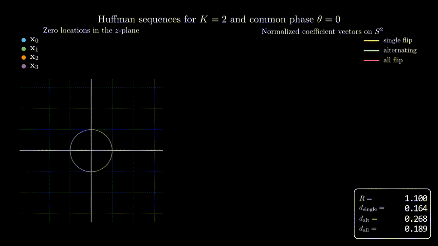

# Huffman-Distances

Repository to be updated with longer and more detailed proofs of Propositions 4 and 5 in [1].

  

## References
[1] P. Huggins, A. Şahin, and E. Erkip, "On the distance properties of Huffman sequences," *IEEE Commun. Lett.*, in preparation.
